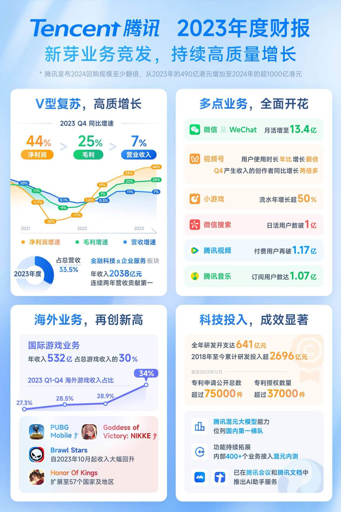

# 朝闻道家庭投资基金周报20240407
小米在汽车发布会后暴涨了半天，然后回落，最终涨幅有限，反倒是A股的小米汽车概念股被炒作了一番。虽然从大定数据等来看，小米Su7算是卖爆了，和我最早预料的一样，只有产能不足的问题，不存在卖不掉的问题。不过看来港股不相信故事，毕竟今年小米卖车，很可能卖一台亏一台，从市场火爆到盈利大赚，还有很长的路要走。我对小米汽车盈利的信心来自两点：一是后续会有更多车型比如SUV上市，很多前期研发费用是可以共享的，二是小米生态链的盈利能力，卖车亏的钱，很可能靠卖配件和周边赚回来。

腾讯2023年年报已发布，各项指标看来，业绩已经出现反转。而且公司会分红并加大回购力度，综合测算股息收益率在4～5%左右。公司在稳定经营的同时，我认为还有一些潜在的增长点：1.微信视频号的商业化依然很克制，比照抖音，还有很多油水可挖；2.人工智能方面，虽然腾讯的技术不是一流的，但是AI机器人嵌入即时通讯，可能是落地场景最丝滑的。

BTC近期继续在6万到7万美金之间震荡。

近期无任何操作。

最新持仓情况 统计时间 20240407

|类别|投资标的|仓位|年初至今|持仓总盈亏|
|---|---|---|---|---|
|现金|人民币|1.00%|||
|证券|贵州茅台|9.20%|-0.63%|562.61%|
|现金|港币|1.40%|||
|证券|腾讯控股|15.20%|5.59%|-10.69%|
|证券|小米集团-W|9.20%|-0.38%|-9.73%|
|证券|哔哩哔哩-W|3.30%|-7.91%|-0.95%|
|证券|阜丰集团|0.80%|9.93%|-3.78%|
|现金|美金|0.50%|||
|证券|瑞幸咖啡|3.30%|-5.65%|-10.51%|
|证券|拼多多|0.90%|-19.44%|-12.96%|
|证券|伯克希尔哈撒韦|0.20%|||
|证券|唯品会|5.40%|-1.52%|1.48%|
|证券|虎牙|0.60%|36.61%|34.92%|
|证券|斗鱼|0.50%|-17.58%|3.28%|
|证券|老凤祥B|1.00%|18.31%|7.19%|
|区块链|BTC|30.20%|56.88%||
|区块链|ETH|17.20%|43.81%||
||总额|100.00%|||