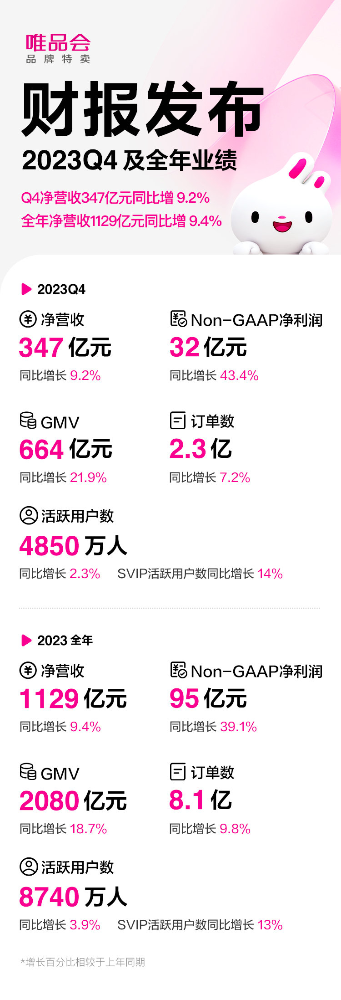
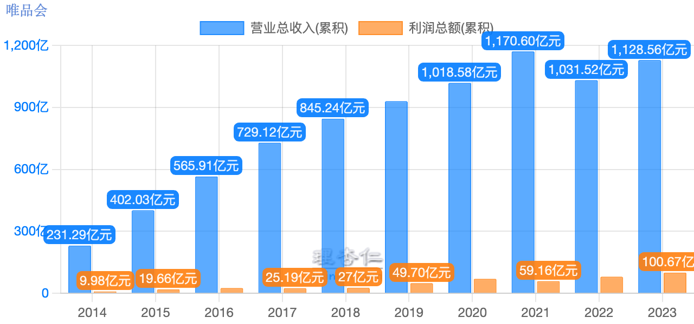

# 朝闻道家庭投资基金周报20240303
本周唯品会发布财报，业绩超出了管理层之前给出的指引，也超出了分析师估计，大涨15%。看最近几年的业绩，可以看到这家公司具备了在各种环境下持续盈利的能力，是一个小而美的公司。以往唯品会回报股东的方式只有回购，今年将开始分红。

稳定盈利有增长，低市盈率，管理层不再盲目花钱和扩张，积极回报股东，这样的股票适合长期持有。雪球上有人讨论：有唯品会为什么要买阿里巴巴？我仔细想了想觉得也对，所以把一点点的阿里巴巴观察仓也清掉换了唯品会。

本周BTC价格一度突破6.4万美金，ETH价格一度突破3500美金，我估计今年都有可能突破历史最高价。但是各种山寨币的价格基本还在坑底，我估计很多永远也回不到历史高位。从终极逻辑上看，所有的数字货币终有一天价值都会归零，但归零的周期会大不一样，真正创新性解决了问题的，共识的基础更牢固，可以炒作的时间就会更久。

本周操作：清空阿里巴巴观察仓，换入唯品会。

最新持仓情况 统计时间 20240303

|类别|投资标的|仓位|年初至今|持仓总亏盈|
|---|---|---|---|---|
|证券|腾讯控股|14.70%|-5.52%|-20.24%|
|证券|贵州茅台|9.70%|-2.37%|551.00%|
|证券|小米集团-W|8.40%|-14.62%|-23.28%|
|证券|唯品会|6.60%|9.01%|14.80%|
|证券|哔哩哔哩-W|3.10%|-16.24%|-12.69%|
|证券|瑞幸咖啡|2.00%|-20.53%|-32.68%|
|证券|拼多多|0.80%|-13.30%|-9.84%|
|证券|斗鱼|0.30%|-20.93%|-4.00%|
|证券|虎牙|0.30%|2.46%|2.29%|
|区块链|BTC|32.40%|40.58%|略|
|区块链|ETH|19.20%|46.03%|略|
|现金|现金及其他|2.50%|||
||||||
|年初净值|5.91||||
|本周净值|6.82||15.42%||